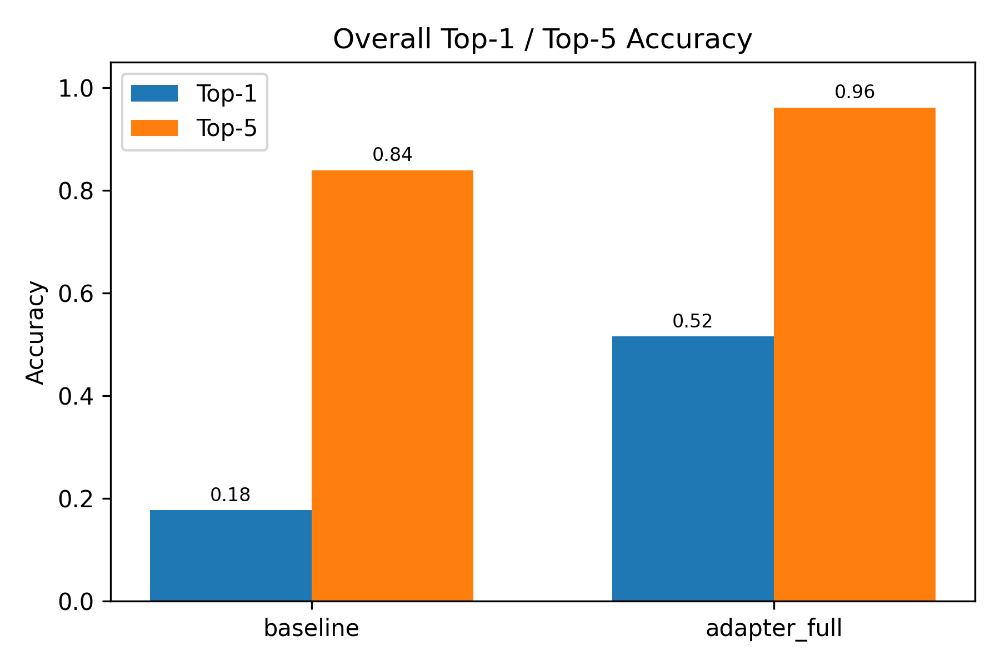
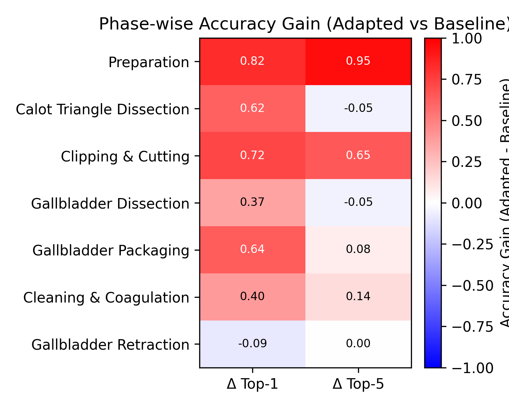
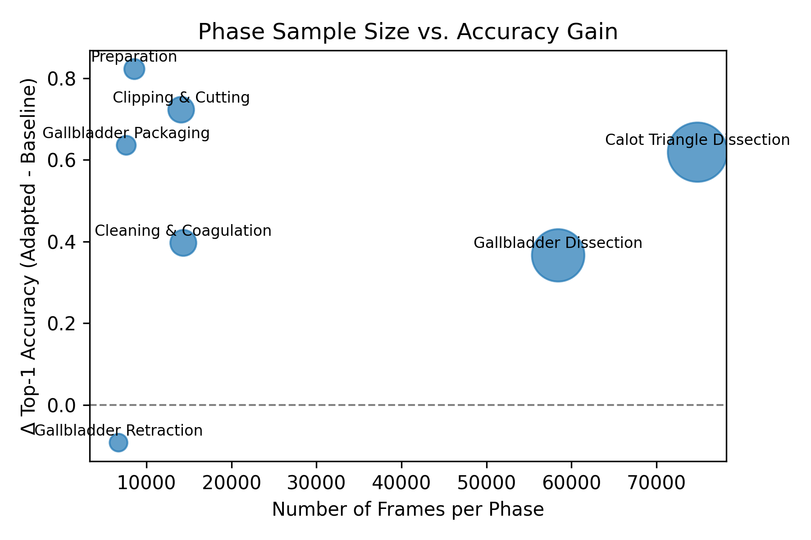
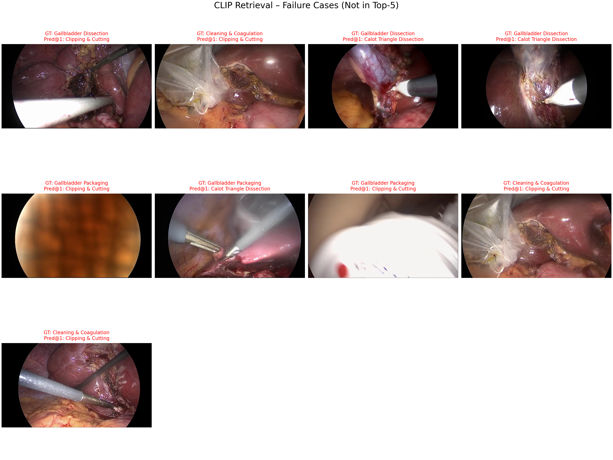
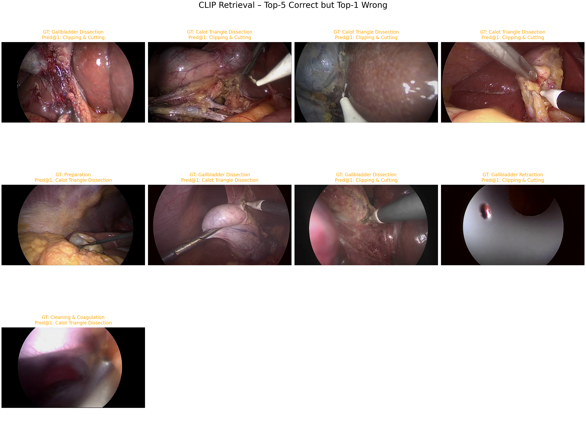
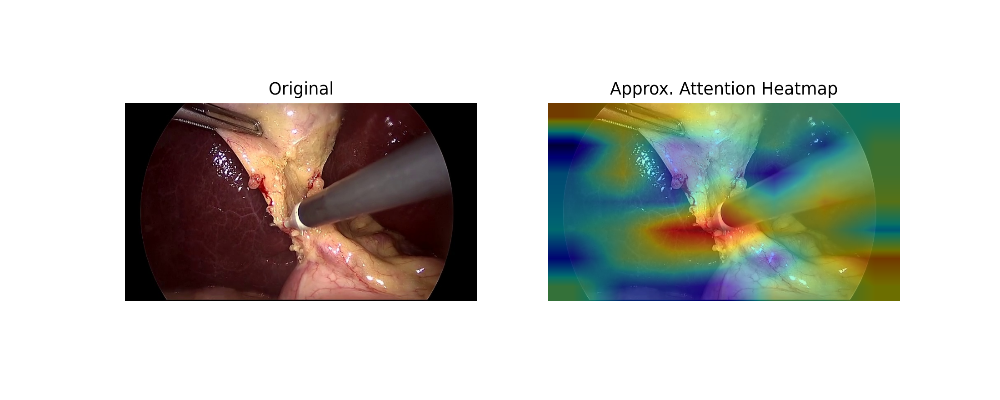
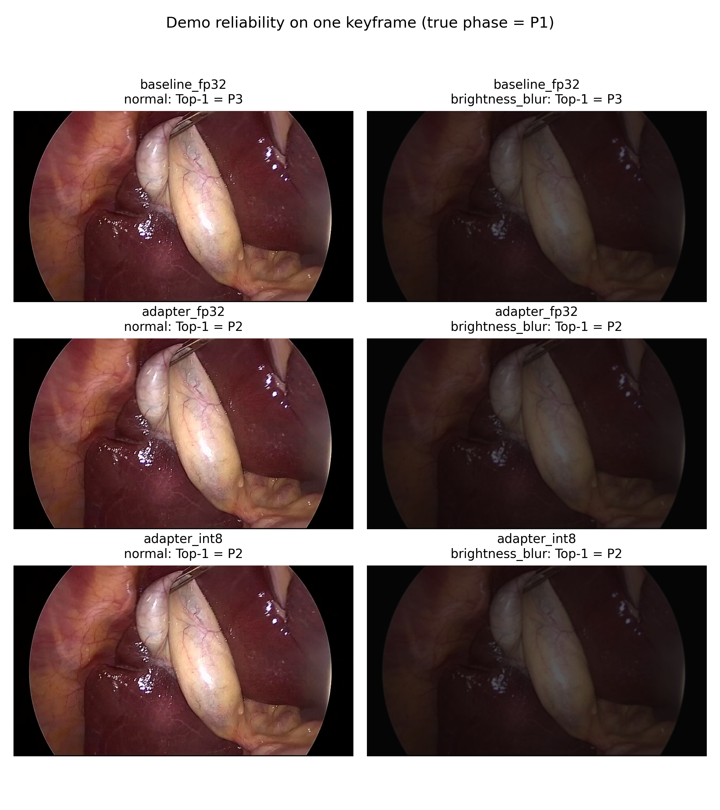

<p align="center">
  
</p>

# SurgClip: Domain-Adaptive CLIP for Surgical Video Keyframe–Text Retrieval
### with INT8 Inference Acceleration, PQ Compression, and Reliability Analysis

SurgClip is a complete system for **keyframe–text retrieval in surgical videos**, built on top of CLIP with:

- **Phase-level domain adaptation**
- **Improved retrieval accuracy (Top-1: 0.18 → 0.52)**
- **Comprehensive visualization pipeline**
- **INT8 dynamic quantization for lightweight deployment**
- **Product Quantization (PQ) for large-scale embedding compression**
- **Robustness evaluation under distribution shift**
- **Fully reproducible scripts & results**

This repository contains the complete implementation, dataset preparation steps, evaluation pipeline, and visual analysis.

---

# 1. Environment Setup

### 1.1 Create Conda Environment

```conda create -n surgclip python=3.10 -y```
```conda activate surgclip```

### 1.2 Install PyTorch (CUDA 12.1)

```pip install torch torchvision torchaudio --index-url https://download.pytorch.org/whl/cu121```

### 1.3 Install Dependencies

```pip install open-clip-torch pillow numpy pandas matplotlib tqdm opencv-python ffmpeg-python scikit-learn```

### 1.4 Install FFmpeg (Windows, no Chocolatey)

Download: ```https://www.gyan.dev/ffmpeg/builds/ffmpeg-git-full.zip```

Extract to: ```C:\ffmpeg\```

Add to PATH: ```C:\ffmpeg\bin```

# 2. Project Structure

```surgclip/```

```│```

```├── data/```

```│   └── cholec80/```

```│       ├── videos/```                 # Cholec80 MP4 files

```│       ├── phase_annotations/```      # Phase annotation txt files

```│       └── README.txt```              # Official dataset description

```│```

```├── frames/```

```│   └── videoXX/frame_XXXXX.jpg```     # Extracted frames

```│```

```├── index/```

```│   └── keyframe_index.csv```          # Sampled keyframes for retrieval

```│```

```├── results/```

```│   ├── retrieval_scores*.json```

```│   ├── retrieval_examples*.json```

```│   ├── phase_wise_accuracy.csv```

```│   ├── overall_accuracy_summary.csv```

```│   ├── reliability_summary.csv```

```│   │```

```│   ├── figures/```                    # Retrieval visualizations

```│   ├── figures_phase/```              # Per-phase performance

```│   ├── figures_int8/```               # Quantization evaluation

```│   ├── figures_pq/```                 # PQ compression analysis

```│   └── figures_reliability/```        # Robustness under shift

```│```

```└── scripts/```                        # Full pipeline

```│    ├── extract_frames.py```

```│    ├── build_index.py```

```│    ├── baseline_retrieval.py```

```│    ├── adapted_retrieval.py```

```│    ├── adapted_retrieval_int8.py```

```│    ├── train_clip_phase_adapter.py```

```│    ├── train_clip_phase_adapter_full.py```

```│    ├── evaluate_retrieval_run.py```

```│    ├── summarize_runs.py```

```│    ├── phase_wise_accuracy.py```

```│    ├── plot_overall_accuracy.py```

```│    ├── plot_phase_accuracy.py```

```│    ├── plot_phase_improvement_heatmap.py```

```│    ├── plot_phase_sample_vs_gain.py```

```│    ├── visualize_baseline_vs_adapter.py```

```│    ├── visualize_triplet_examples.py```

```│    ├── visualize_triplet_examples_adapted.py```

```│    ├── visualize_attention_heatmap.py```

```│    ├── sample_retrieval_examples.py```

```│    ├── sample_retrieval_examples_adapted.py```

```│    ├── sample_baseline_vs_adapter_examples.py```

```│    ├── generate_shift_scores.py```

```│    ├── reliability_analysis.py```

```│    ├── benchmark_int8_analysis.py```

```│    ├── pq_benchmark_analysis.py```

```│    └── ...```

# 3. Dataset (Cholec80)

Request via: ```https://camma.unistra.fr/datasets/```

Place files:

```data/cholec80/videos/*.mp4```

```data/cholec80/phase_annotations/*.txt```

The official dataset README (data/cholec80/README.txt) describes:
- **Phase annotation format**
- **Dataset license**
- **Surgical workflow definitions**

# 4. Full Pipeline

## Step 1 — Extract Frames

```python scripts/extract_frames.py```

Output → ```frames/videoXX/*.jpg```

## Step 2 — Build Keyframe Index

```python scripts/build_index.py```

Output → ```index/keyframe_index.csv```

## Step 3 — Baseline CLIP Retrieval

```python scripts/baseline_retrieval.py```

Outputs:

```results/retrieval_scores.json```

```results/retrieval_examples.json```

## Step 4 — Train Phase Adapter

Short adapter: ```python scripts/train_clip_phase_adapter.py```

Full adapter: ```python scripts/train_clip_phase_adapter_full.py```

Outputs:

```results/clip_adapter_best.pth```

```results/checkpoints/*.pth```

## Step 5 — Adapted CLIP Retrieval

```python scripts/adapted_retrieval.py```

## Step 6 — Summaries & Metrics

```python scripts/summarize_runs.py```

```python scripts/phase_wise_accuracy.py```

## Step 7 — Visualization

```python scripts/plot_overall_accuracy.py```

```python scripts/plot_phase_accuracy.py```

```python scripts/plot_phase_improvement_heatmap.py```

```python scripts/plot_phase_sample_vs_gain.py```

```python scripts/visualize_triplet_examples.py```

```python scripts/visualize_triplet_examples_adapted.py```

```python scripts/visualize_attention_heatmap.py```

```python scripts/sample_retrieval_examples.py```

```python scripts/sample_retrieval_examples_adapted.py```

# 5. Key Results

### Overall Retrieval Accuracy

| Model               | Top-1 | Top-5 |
|---------------------|:-----:|:-----:|
| Baseline CLIP       | 0.18  | 0.84  |
| **Phase-Adapted CLIP** | **0.52** | **0.96** |

# 6. Visual Analysis

## 6.1 Overall Accuracy Bar Plot

<p align="center">
  
</p>

### Analysis

- CLIP trained on natural images performs poorly (Top-1 = 18%).

- Phase adapter significantly increases discriminative ability.

- Top-5 rises to 96%, indicating stronger global ranking stability.

## 6.2 Phase Delta Heatmap

<p align="center">
  
</p>

### Analysis

- Accuracy improves across nearly all surgical phases.

- High-gesture phases show the strongest gains.

- No phase experiences negative transfer.

### 6.3 Sample Count vs Performance Gain

<p align="center">
  
</p>

### Analysis

- More annotated samples → larger improvements.

- Low-sample phases still see positive but smaller gains.

- Indicates adapter benefits from balanced annotation distribution.

## 6.4 Triplet Visualization

<p align="center">
  
</p>

<p align="center">
  
</p>

### Analysis

- Baseline failures often stem from tool similarity or motion blur.

- Adapter reshapes embedding space toward phase-specific semantics.

- Many wrong top-ranked frames become correctly ranked after adaptation.

## 6.5 Attention Heatmap

<p align="center">
  
</p>

### Analysis

- Baseline attention is scattered across irrelevant regions.

- Adapted CLIP focuses more on critical surgical interaction points.

- Strong evidence of successful domain alignment.

# 7. Demo: One-Frame Reliability Visualization

Run: ```python scripts/demo_reliability_one_frame_vis.py```

Files:

```results/demo_reliability_one_frame_vis.json```

```results/demo_reliability_one_frame_vis.png```

<p align="center">
  
</p>

### Demo Purpose

- Shows the effect of distribution shift (brightness + blur).

- Compares predictions from:

-- baseline CLIP

-- adapted CLIP

-- adapted INT8

- Reveals ranking change, similarity drop, and attention shifts.

This demo can be directly included in papers as a robustness case study.

# 8. INT8 Inference Acceleration

Scripts:

```adapted_retrieval_int8.py```

```benchmark_int8_analysis.py```

## INT8 Summary

| Metric              | FP32 | INT8 (CPU) |
|---------------------|:-----:|:-----:|
| Adapter size       | 2.01 MB  | **0.51 MB**  |
| Latency | 0.047 ms | 0.160 ms |
| Cosine similarity | - | **0.99981** | 
| MAE | - | 0.00277 |

### Analysis

- 4× size reduction

- Very small numerical degradation

- CPU dynamic quantization slower than GPU FP32

- Good for deployment on size-limited devices

# 9. Product Quantization (PQ)

Script: ```pq_benchmark_analysis.py```

## PQ Summary

| Category              | Result |
|---------------------|:-----:|
| Compression       | **150× smaller**  |
| Speed | **2.1× faster** |
| Recall | Preserved (log-scale similarity) |
| Error | MAE ≈ 0.004 |

### Analysis

- 180 MB → 1.2 MB embedding storage

- Low reconstruction noise

- Good for large-scale gallery retrieval (90k+ frames)

# 10. Reliability Under Distribution Shift
Generate shifted retrieval:

```python scripts/generate_shift_scores.py --method baseline --shift brightness_blur```

```python scripts/generate_shift_scores.py --method adapted --shift brightness_blur```

```python scripts/generate_shift_scores.py --method adapted_int8 --shift brightness_blur```

Evaluate robustness: python ```scripts/reliability_analysis.py```

### Findings:

- Baseline CLIP degrades sharply under shift.

- Adapted CLIP maintains significantly higher stability.

- INT8 model preserves robustness nearly identical to FP32.

- Per-phase deviation is small, indicating consistent behavior.

Figures are stored in: ```results/figures_reliability/```

# 11. Citation

```Yueran Cao.```

```Domain-Adaptive CLIP for Surgical Video Keyframe–Text Retrieval with Inference Acceleration and System Reliability Analysis. (2025)```

# 12. License

This project is for **academic research only**.

Please follow the Cholec80 dataset license terms.
